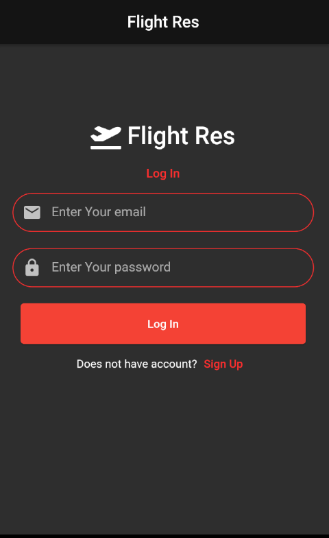
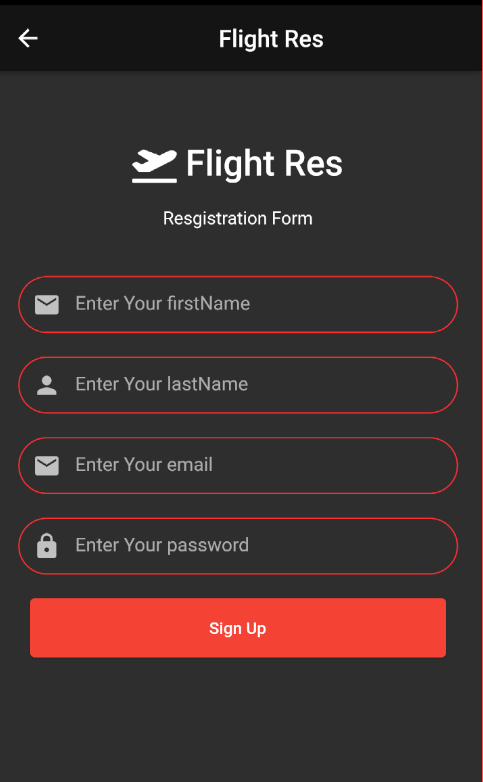
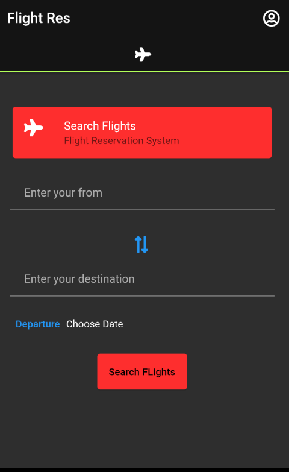
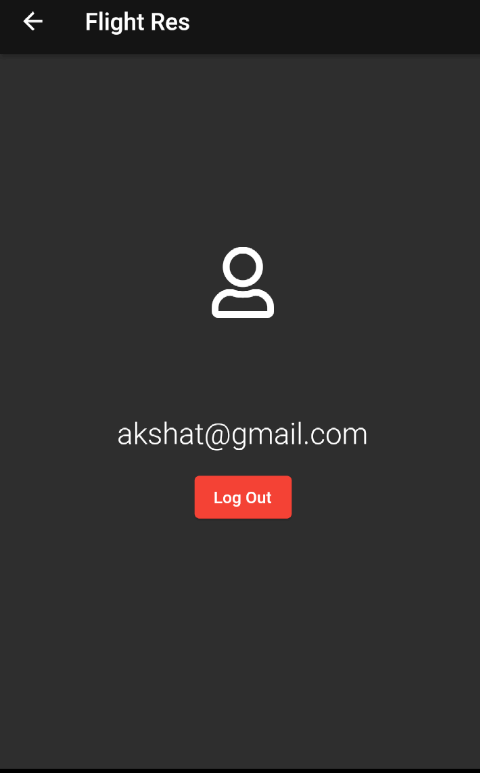
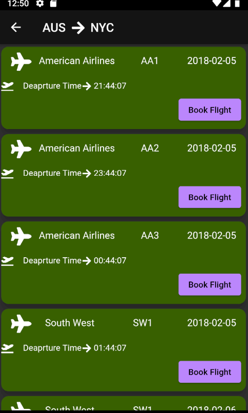

# flight_res_system

Flight Reservation System APP.

Considers user LOGIN/Register pages with a SImple UI.

Used SQL Database with flutter for storing data of flights.

Contains search flight option which runs query on the Database and gives results.

User Profile Page with LOGOUT feature.

<li>
  
  
  
</li>

